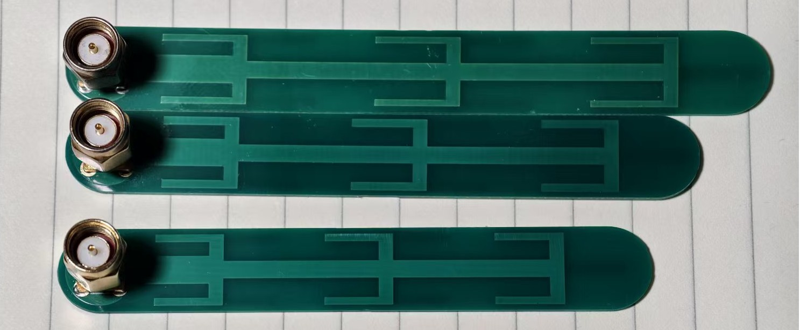

# SwordAntennaClone
This is a clone of [OpenHD/SwordAntenna](https://github.com/OpenHD/SwordAntenna).   
  
I made re-tunings to 5.7GHz band `(5500MHz~5825MHz)` and 6.2GHz band `(5925MHz~6425MHz, Wi-Fi 6e/7/... for future)`, respectively.  
  
Huge thanks to Maple Wireless as they open-sourced such a good design.  

  

## Design Files
`Gerber*.zip`: exported Gerber files  
`ProDoc*.epro2`: Use 嘉立创EDA专业版 (EasyEDA PRO) to import it, then modify (**ONLY** use it when you need to bypass the free sample's similarity check in JLCPCB; **DO NOT TOUCH the copper & board outline**, just add some small silk on the edge)   
  
`5G7` PCB Size: `12.0mm * 88.0mm * 1.0mm` (SMA not included)  
`6G2` PCB Size: `12.0mm * 81.8mm * 1.0mm` (SMA not included) 

The connector in the image above is `SMA-JE`. It should be soldered to the bottom layer (the side with GND copper; or check the 3D model in EasyEDA), then trim the pin to flatten.  

## PCB Ordering 
`2` Layers, `1.0mm` total. Same as original.   
See [here](https://github.com/OpenHD/SwordAntenna/blob/main/IMG_20201030_173201_056.jpg) (screenshot at https://jlcpcb.com/) and [here](https://github.com/OpenHD/SwordAntenna/blob/main/IMG_20201030_173211_296.jpg).    
  
This clone does not care about the `Surface Finish`. Both `HASL (lead or lead-free)`, `ENIG`, and `OSP` are OK.  

## License
As the original repository does not include or claim any open source license, I'll leave it empty.  
If [OpenHD/SwordAntenna](https://github.com/OpenHD/SwordAntenna) updates, will use the same license here.  

## Antenna Characteristics 
See `SwordAntennaClone*/img/` for simulated & measured results.   

A dipole of such a shape only gives one zero on S11/VSWR, and the phase-shifting strip in the middle works on only one certain frequency as well, which means it cannot give broadband (> 10%, or more) impedance and radiation.  
So the S11 and gain at both ends of the band will very likely not be as good as expected (but still usable -- VSWR<2).   
Better choose channels in the middle, like 6.1G\~6.3G for the 6G2, and 5.5G\~5.75G for the 5G7.  
**I recommend getting at least a LiteVNA or similar to measure, then choose a good channel.**  
For Wi-Fi 6e/7/..., LiteVNA's harmonic mode gives rough estimations above 6.3GHz... yes, but better than nothing.  

**Disclaimer**: 
1. The FR-4 permittivity and/or PCB thickness may vary in different batches, and the center frequency may change by +-100MHz.   
2. The `5G7` variant has a good S11 in `4.9GHz~5.5GHz`; same as `6G2` in `5.5GHz~5.8GHz`. But it's only the **Impedance Bandwidth**, not the Radiation Bandwidth. It's not designed to radiate here. 
3. There's no measured data on radiation efficiency and radiation pattern, because I have no anechoic chamber (.  
4. The S11 and VSWR performance above 6.3GHz of the 6G2 variant was measured by LiteVNA's harmonic mode, so it looks a bit noisy...  
